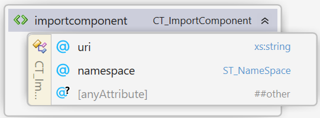
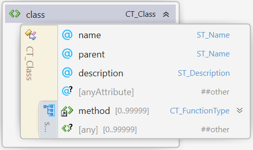
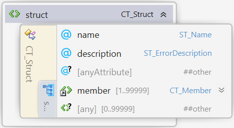

#  Automatic Component Toolkit

## Specification of the Interface Description Language of the Automatic Component Toolkit (ACT-IDL)

| **Version** | 1.6.0 |
| --- | --- |

## Disclaimer

THESE MATERIALS ARE PROVIDED "AS IS." The contributors expressly disclaim any warranties (express, implied, or otherwise), including implied warranties of merchantability, non-infringement, fitness for a particular purpose, or title, related to the materials. The entire risk as to implementing or otherwise using the materials is assumed by the implementer and user. IN NO EVENT WILL ANY MEMBER BE LIABLE TO ANY OTHER PARTY FOR LOST PROFITS OR ANY FORM OF INDIRECT, SPECIAL, INCIDENTAL, OR CONSEQUENTIAL DAMAGES OF ANY CHARACTER FROM ANY CAUSES OF ACTION OF ANY KIND WITH RESPECT TO THIS DELIVERABLE OR ITS GOVERNING AGREEMENT, WHETHER BASED ON BREACH OF CONTRACT, TORT (INCLUDING NEGLIGENCE), OR OTHERWISE, AND WHETHER OR NOT THE OTHER MEMBER HAS BEEN ADVISED OF THE POSSIBILITY OF SUCH DAMAGE.

## Table of Contents

- [Preface](#preface)
   * [Document Conventions](#document-conventions)
   * [Language Notes](#language-notes)
 - [Elements and types in the ACT-IDL](#elements-and-types-in-the-act-idl)
   * [1. Component](#1-component)
   * [2. Import Component](#2-import-component)
   * [3. License](#3-license)
   * [4. License Line](#4-license-line)
   * [5. Bindings](#5-bindings)
   * [6. Implementations](#6-implementations)
   * [7. Export](#7-export)
   * [8. Global](#8-global)
   * [9. Class](#9-class)
   * [10. Function Type](#10-function-type)
   * [11. Param](#11-param)
   * [12. Enum](#12-enum)
   * [13. Option](#13-option)
   * [14. Struct](#14-struct)
   * [15. Member](#15-member)
   * [16. Errors](#16-errors)
   * [17. Error](#17-error)
   * [18. Simple Types](#18-simple-types)
 - [Appendix A. XSD Schema of ACT-IDL](#appendix-a-xsd-schema-of-act-idl)
 - [Appendix B. Example of ACT-IDL](#appendix-b-example-of-act-idl)

# Preface

## Document Conventions

Except where otherwise noted, syntax descriptions are expressed in the ABNF format as defined in RFC 4234.

Glossary terms are formatted like _this_.

Syntax descriptions and code are formatted as `Markdown code blocks.`

Replaceable items, that is, an item intended to be replaced by a value, are formatted in _`monospace cursive`_ type.

Notes are formatted as follows:

>**Note:** This is a note.

## Language Notes

In this specification, the words that are used to define the significance of each requirement are written in uppercase. These words are used in accordance with their definitions in RFC 2119, and their respective meanings are reproduced below:

- _MUST._ This word, or the adjective "REQUIRED," means that the item is an absolute requirement of the specification.
- _SHOULD._ This word, or the adjective "RECOMMENDED," means that there may exist valid reasons in particular circumstances to ignore this item, but the full implications should be understood and the case carefully weighed before choosing a different course.
- _MAY._ This word, or the adjective "OPTIONAL," means that this item is truly optional.

# Elements and types in the ACT-IDL

## 1. Component
Element **\<component>** of type **CT\_Component**

##### Attributes
| Name | Type | Use | Default | Annotation |
| --- | --- | --- | --- | --- |
| libraryname | **ST\_LibraryName** | required | | Specifies the name of the component. Can contain spaces. |
| namespace | **ST\_NameSpace** | required | | Specifies the namespace for the components's functionality. |
| copyright | **xs:string** | required | | The legal copyright holder. |
| basename | **ST\_BaseName** | required | | The basename will be used as prefix for generated filenames and all sorts of identifiers in the generated source code. |
| version | **ST\_Version** | required | | The semantic version of this component. |
| year | **ST\_Year** | optional | the current year | The year associcated with the copyright. |
| @anyAttribute | | | | |

It is RECOMMENDED that components generated with ACT follow the [semantic versioning scheme](https://semver.org/).
The "version" attribute encodes the semantic version of this component. Major, Minor and Micro-version info MUST be included. Pre-release information and build information MAY be included.

The \<component> element is the root element of a ACT-IDL file.
There MUST be exactly one \<component> element in a ACT-IDL file.
A component MUST have exactly one child [license](#3-license) element, 
one child [bindings](#5-bindings) element, 
one child [implementations](#6-implementations) element, 
one child [errors](#16-errors) element and 
one child [global](#8-global) element.

The names of the \<struct>-, \<enum>-, \<functiontype>- and \<class>-elements MUST be unique within the \<component>.

>**Note:** Regarding the \"uniqueness\" of attributes of type **xs:string**.
>Within this specification strings are considered equal regardless of the case of the individual letters.

## 2. Import Component
Element **\<importcomponent>** of type **CT\_ImportComponent**

The \<importcomponent> element defines the namespace and the relative location of another ACT-IDL-file and is the mechanism that allows injecting another ACT-component into the ACT-component at hand.

The `namespace` attribute of the \<importcomponent> element MUST match the `namespace` of the \<component> element within the file at location of the `uri` attribute.

The `class`es, `functiontype`s, `struct`s and `enum`s of the importend component with will be available as `param`s of methods in this ACT-component. 
To use an entity with name `Y` from another ACT component (with namespace `X`) as `class` of a `param` in this ACT component set the `class`-attribute to `class="X:Y"`.

To be able to inject a component `Inner` into a component `Outer`, component `Inner` must define the `symbollookupmethod` in its global section and component `Outer` must define the `injectionmethod`.

>**Note:** Component injection is an advanced feature. Not all bindings support it.
> See [the Injection example](../Examples/Injection) for a minimal working example.

## 3. License
Element **\<license>** of type **CT\_License**

The \<license> element contains a list of at least one child [line](#3-line) element.
The license lines will be included as comments at the start of all generated source code files.

## 4. Line
Element **\<line>** of type **CT\_LicenseLine**

##### Attributes
| Name | Type | Use | Default | Annotation |
| --- | --- | --- | --- | --- |
| value | **xs:string** | required | | A line of the license. |

## 5. Bindings
Element **\<bindings>** of type **CT\_BindingList**

The CT\_BindingList type contains a list of [binding](#7-export) elements.
The \<binding> elements in the \<bindings> element determine the language bindings that will be generated.

## 6. Implementations
Element **\<implementations>** of type **CT\_ImplementationsList**

The CT\_ImplementationsList type contains a list of [implementation](#7-export) elements.
The \<implementation> elements in the \<implementations> element determine the languages for which implementation stubs will be generated.

## 7. Export
Element **\<binding>**
 

 
Element **\<implmentation>**
 

 
of type **CT\_Export**
 

##### Attributes
| Name | Type | Use | Default | Annotation |
| --- | --- | --- | --- | --- |
| language | **ST\_Language** | required | | The programming langugage of this export. |
| indentation | **ST\_Indentation** | optional | 4spaces | Which string should be used to denote a single level of indentation in the generated source code files. |
| stubidentifier | **ST\_StubIdentifier** | optional | "" | Generated sources files of this export will follow the naming schme "...${BaseName}_${stubidentifier}...". Only used in \<implementation> right now. |
| classidentifier | **ST\_ClassIdentifier** | optional | "" | Generated classes of this export will follow the naming schme "...${ClassIdentifier}_${ClassName}...". The only binding that supports this are the C++-bindings.|

## 8. Global
Element **\<global>** of type **CT\_Global**

##### Attributes
| Name | Type | Use | Default | Annotation |
| --- | --- | --- | --- | --- |
| baseclassname | **ST\_Name** | required | | Specifies the name of a class that is the base class for all classes of the generated component. |
| acquiremethod | **ST\_Name** | required | | Specifies the name of the method used to acquire ownership of a class instance owned by the generated component. |
| releasemethod | **ST\_Name** | required | | Specifies the name of the method used to release ownership of a class instance owned by the generated component. |
| errormethod | **ST\_Name** | required | | Specifies the name of the method used to query the last error that occured during the call of class's method. |
| versionmethod | **ST\_Name** | required | | Specifies the name of the method used to obtain the major, minor and micro version of the component. |
| prereleasemethod | **ST\_Name** | required | | Specifies the name of the method used to obtain the prerelease information of the component. |
| buildinfomethod | **ST\_Name** | optional | | Specifies the name of the method used to obtain the build information of the component. |
| injectionmethod | **ST\_Name** | optional | | Specifies the name of the method used to inject the symbollookupmethod another ACT component into this component at runtime. |
| symbollookupmethod | **ST\_Name** | optional | | Specifies the name of the method that returns the address of a given symbol exported by this component. |
| journalmethod | **ST\_Name** | optional | | Specifies the name of the method used to set the journal file. If ommitted, journalling will not be built into the component. |

The \<global> element contains a list of [method](#10-function-type) elements that define the exported global functions of the component and defines special methods of the component.
The names of the \<method> elements MUST be unique within the \<global> element.

The `baseclassname`-attribute must be the name of a \<class> element within the components list of classes.
This class will be the base class for all classes of the generated component.

The `acquiremethod`- and `releasemethod`-attributes must each be the name of a \<method> within the \<global> element of a component that has exactly one parameter with `type="class"`, `class="BaseClass"` and `pass="in"`.
The `versionmethod`-attribute must be the name of a \<method> within the \<global> element of a component that has exactly three parameters. The three parameters MUST be of type `type="uint32"` and `pass="out"`.
The `prereleasemethod`-attribute is optional an can be the name of a \<method> within the \<global> element of a component that has two parameters.
The first parameter MUST be of type `type="bool"` and `pass="return"`, the second parameter MUST be of type `type="string"` and `pass="out"`.
The `buildinfomethod`-attribute is optional an can be the name of a \<method> within the \<global> element of a component that has two parameters.
The first parameter MUST be of type `type="bool"` and `pass="return"`, the second parameter MUST be of type `type="string"` and `pass="out"`.

The `errormethod`-attribute must be the name of a \<method> within the \<global> element of a method that has exactly three parameters:
1. `type="class"`, `class="$BASECLASSNAME"` and `pass="in"`, where `"$BASECLASSNAME"` is the value of the `baseclassname` attribute of the \<global> element.
2. `type="string"` and `pass="out"`: outputs the last error message
3. `type="bool"` and `pass="return"`: returns the instance of the baseclass has an error.

If the `injectionmethod` attribute is given, it must be the name of a \<method> within the \<global> element of a method that has exactly two parameters with `type="string"` and `pass="in"` and `type="pointer"` and `pass="in"`.

If the `symbollookupmethod` attribute is given, it must be the name of a \<method> within the \<global> element of a method that has exactly one parameter with `type="pointer"` and `pass="return"`. The implemntation of this method is fully autogenerated and returns the address of another internal lookup method. This internal lookup method in turn is similar to a `GetProcAddress`- or `dlsym`-method: given the name of a method in this component, it provides the address of a method in this component with this name. The return value of the `symbollookupmethod` is usually passed into the `injectionmethod` of another component.

If the `journalmethod` attribute is given, it must be the name of a \<method> within the \<global> element of a method that has exactly one parameter with `type="string"` and `pass="in"`.

## 9. Class
Element **\<class>** of type **CT\_Class**

##### Attributes
| Name | Type | Use | Default | Annotation |
| --- | --- | --- | --- | --- |
| name | **ST\_Name** | required | | The name of this class. |
| parent | **ST\_Name** | optional | | The name of the parent class of this class. |
| description | **ST\_Description** | optional | | A description of this class. |

The \<class> element contains a list of [method](#10-function-type) elements that define the exported member functions of this class.
The names of the \<method> elements MUST be unique in this list.

If the `parent`-attribute is empty, and the name of this class differs from the `baseclassname`-attribute of the \<global> element, `baseclassname` will be considered as the parent class of this class.

A class MUST be defined in the list of \<class> elements before it is used as parent-class of another class. This restiction rules out circular inheritance. Moreover, the default `baseclassname` MUST be defined as the first \<class> within the IDL-file.

## 10. Function Type
Element **\<functiontype>**
 

Element **\<method>**
 

of Complex type **CT\_FunctionType**
 

##### Attributes
| Name | Type | Use | Default | Annotation |
| --- | --- | --- | --- | --- |
| name | **ST\_Name** | required | | The name of this function type. |
| description | **ST\_Description** | required | | A description of this function type. |

The CT\_FunctionType-type describes the signature of a function in the interface.
Each element of type CT\_FunctionType contains a list of [param](#11-param) elements.
The names of the param in this list MUST be unique.
This list MUST contain zero or one param-elements with the pass-value \"return\".

The \<functiontype>-element can be used to define callback functions into the consumer's code.

## 11. Param
Element **\<param>** of type **CT\_Param**

##### Attributes
| Name | Type | Use | Default | Annotation |
| --- | --- | --- | --- | --- |
| name | **ST\_Name** | required | | The name of this parameter. |
| pass | **ST\_Pass** | required | | Specifies whether the parameter is passed "in", "out" or as "return"-value of the enclosing functiontype. |
| type | **ST\_Type** | required | | The type of this parameter. |
| class | **ST\_Name** | optional | | Required if the type is an [**ST\_ComposedType**](#173-composedtype) |
| description | **ST\_Description** | optional | | A description of this enumerated type. |

## 12. Enum
Element **\<enum>** of type **CT\_Enum**

##### Attributes
| Name | Type | Use | Default | Annotation |
| --- | --- | --- | --- | --- |
| name | **ST\_Name** | required | | The name of this enumerated type. |
| description | **ST\_Description** | optional | | A description of this enumerated type. |

The \<enum> element defines an enumerated type (see https://en.wikipedia.org/wiki/Enumerated_type), i.e. a set of named values. 
It contains a list of at least one [option](#13-option) element.
The names as well as the values of the options in this list MUST be unique within a \<enum> element.

## 13. Option
Element **\<option>** of type **CT\_Option**

##### Attributes
| Name | Type | Use | Default | Annotation |
| --- | --- | --- | --- | --- |
| name | **ST\_Name** | required | | The name of this option. |
| value | **xs:nonNegativeInteger** | required | | The numerical value of this option. |
| description | **ST\_Description** | optional | | A description of this option. |

## 14. Struct
Element **\<struct>** of type **CT\_Struct**

##### Attributes
| Name | Type | Use | Default | Annotation |
| --- | --- | --- | --- | --- |
| name | **ST\_Name** | required | | The name of this struct. |
| description | **ST\_Description** | optional | | A description of this struct. |

The \<struct> element defines a composite data type (see https://en.wikipedia.org/wiki/Composite_data_type).  
It contains a list of at least one [member](#15-member) element.
The names of the member elements MUST be unique within a struct element.

## 15. Member
Element **\<member>** of type **CT\_Member**

##### Attributes
| Name | Type | Use | Default | Annotation |
| --- | --- | --- | --- | --- |
| name | **ST\_Name** | required | | The name of this member. |
| type | **ST\_ScalarType** | required | | The scalar type of this member. |
| rows | **xs:positiveInteger** | optional | 1 | The number of rows of this member. |
| columns | **xs:positiveInteger** | optional | 1 | The number of columns of this member. |
| description | **ST\_Description** | optional | | A description of this member. |

The \<member> element defines a member (or "field") within a struct. Only [**ST\_ScalarType**](#172-scalartype) is allowed within structs.
By default, the member defines a single value of its type within the enclusing struct. One- or two-dimensional arrays of fixed size can be
defined by setting the rows and colums attributes to the desired size of the array.

## 16. Errors
Element **\<errors>** of type **CT\_ErrorList**

The \<errors> element contains a list of [\<error>](#17-error) elements.
The names and codes of the \<error> elements in this list MUST be unique within the \<errors> element.

Each ACT-component MUST contain at least the following 8 error codes:

`NOTIMPLEMENTED`, `INVALIDPARAM`, `INVALIDCAST`, `BUFFERTOOSMALL`, `GENERICEXCEPTION`, `COULDNOTLOADLIBRARY`, `COULDNOTFINDLIBRARYEXPORT`, `INCOMPATIBLEBINARYVERSION`

## 17. Error
Element **\<error>** of type **CT\_Error**

##### Attributes
| Name | Type | Use | Default | Annotation |
| --- | --- | --- | --- | --- |
| name | **ST\_ErrorName** | required | | The name of this error. |
| code | **xs:positiveInteger** | required | | The numerical error code of this error. |
| description | **ST\_ErrorDescription** | otpional | | A short description of this error. |

## 18. Simple Types
The simple types of this specification encode features, concepts, data types,
and naming rules used in or required by programming languages.

For now, please look the up in the [ACT.xsd](../Source/ACT.xsd).

### 18.1 Type
Supported types are:
- `bool`: denotes a boolean value (`true` or `false`).
Although this can be encoded in a single bit, the thin C89-layer APIs generated by ACT will use an unsigned 8 bit value (a `uint8` in ACT terms) to encode a boolean value.
A numerical value of `0` encodes `false`, all oher values encode `true`.
Implementations and bindings should use the definition of a boolean value that is native to the respective language of the implementation or binding.
- `uint8`, `uint16`, `uint32`, `uint64`:
An _unsigned_ integer vaules ranging from 0 - 28-1, 0 - 216-1, 0 - 232-1, 0 - 264-1, respectively.
- `int8`, `int16`, `int32`, `int64`:
A _signed_ integer vaules ranging from -27 - 27-1, -215 - 215-1,
-231 - 231-1,
-263 - 263-1, respectively.
- `pointer`: An address in memory without knowledge of the kind of data that resides there. In C++, this corresponds to a `void*`.
- `string` denotes a null-terminated string. If a component requires arbitrary strings that can contain null-characters, one should use the type `basicarray` of class `uint8`. When using `string` as `out`- or `return`-parameter, the size of the buffer that is passed through the ABI includes the terminating null-character.

- `single`: Single precision floating point number.
- `double`: Double precision floating point number.
- `struct`: see [13. Struct](#14-struct)
- `enum`: see [11. Enum](#12-enum)
- `basicarray`: an array of [ST\_ScalarTypes](#18-2-scalartype)
- `enumarray`: an array of [enums](#12-enum)
- `structarray`: an array of [structs](#14-struct)
- `functiontype`: see [9. Function Type](#10-function-type)
- `class`: the identifier (address, unique identifier, hash, ...) of a class instance [class instance](#9-class)
- `optionalclass`: behaves just like `class`, however, this instance may be empty, or null. A use case for `optionalclass` is e.g. a `findElementByName`-method of a list, which might or might not return a class instance.

**Note**
 `type="handle"` is equivalent to `type="class"` for backwards compatibility. It will be removed in a future version.

### 18.2 ScalarType
A subset of scalar or integral of ST\_Type:

`bool`, `uint8`, `uint16`, `uint32`, `uint64`, `int8`, `int16`, `int32`, `int64`, `single`, `double`, `pointer`.

### 18.3 ComposedType
A subset of more complex types, or types composed of other ST\_Types:

`string`, `enum`, `basicarray`, `enumarray`, `structarray`, `class`, `functiontype`

### 18.4 Name
### 18.5 Description
### 18.6 ErrorName
### 18.7 ErrorDescription
### 18.8 Pass
### 18.9 Language
### 18.10 Indentation
### 18.11 Year
### 18.12 Version
### 18.13 Stub Identifier
### 18.14 Class Identifier
### 18.16 NameSpace
### 18.15 Library Name
### 18.16 Base Name

# Appendix A. XSD Schema of ACT-IDL
See [ACT.xsd](../Source/ACT.xsd)

# Appendix B. Example of ACT-IDL
See [libPrimes.xml](../Examples/Primes/libPrimes.xml)
