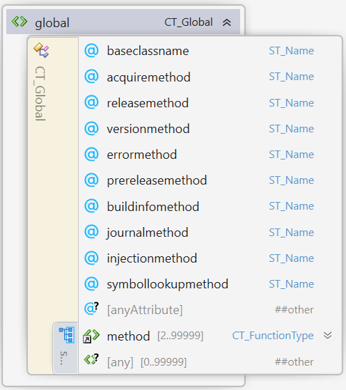
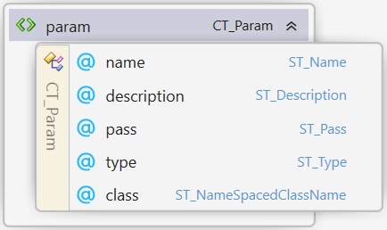
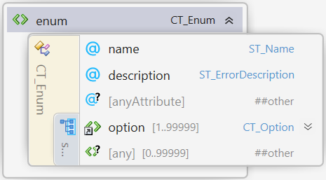

#  Automatic Component Toolkit

## Specification of the Interface Description Language of the Automatic Component Toolkit (ACT-IDL)

| **Version** | 0.1.0 |
| --- | --- |

## Disclaimer

THESE MATERIALS ARE PROVIDED "AS IS." The contributors expressly disclaim any warranties (express, implied, or otherwise), including implied warranties of merchantability, non-infringement, fitness for a particular purpose, or title, related to the materials. The entire risk as to implementing or otherwise using the materials is assumed by the implementer and user. IN NO EVENT WILL ANY MEMBER BE LIABLE TO ANY OTHER PARTY FOR LOST PROFITS OR ANY FORM OF INDIRECT, SPECIAL, INCIDENTAL, OR CONSEQUENTIAL DAMAGES OF ANY CHARACTER FROM ANY CAUSES OF ACTION OF ANY KIND WITH RESPECT TO THIS DELIVERABLE OR ITS GOVERNING AGREEMENT, WHETHER BASED ON BREACH OF CONTRACT, TORT (INCLUDING NEGLIGENCE), OR OTHERWISE, AND WHETHER OR NOT THE OTHER MEMBER HAS BEEN ADVISED OF THE POSSIBILITY OF SUCH DAMAGE.

## Table of Contents

- [Preface](#preface)
   * [Document Conventions](#document-conventions)
   * [Language Notes](#language-notes)
 - [Elements and types in the ACT-IDL](#elements-and-types-in-the-act-idl)
   * [1. Component](#1-component)
   * [2. License](#2-license)
   * [3. License Line](#3-license-line)
   * [4. Bindings](#4-bindings)
   * [5. Implementations](#5-implementations)
   * [6. Export](#6-export)
   * [7. Global](#7-global)
   * [8. Class](#8-class)
   * [9. Function Type](#9-function-type)
   * [10. Param](#10-param)
   * [11. Enum](#11-enum)
   * [12. Option](#12-option)
   * [13. Struct](#13-struct)
   * [14. Member](#14-member)
   * [15. Errors](#15-errors)
   * [16. Error](#16-error)
   * [17. Simple Types](#17-simple-types)
 - [Appendix A. XSD Schema of ACT-IDL](#appendix-a-xsd-schema-of-act-idl)
 - [Appendix B. Example of ACT-IDL](#appendix-b-example-of-act-idl)

# Preface

## Document Conventions

Except where otherwise noted, syntax descriptions are expressed in the ABNF format as defined in RFC 4234.

Glossary terms are formatted like _this_.

Syntax descriptions and code are formatted as `Markdown code blocks.`

Replaceable items, that is, an item intended to be replaced by a value, are formatted in _`monospace cursive`_ type.

Notes are formatted as follows:

>**Note:** This is a note.

## Language Notes

In this specification, the words that are used to define the significance of each requirement are written in uppercase. These words are used in accordance with their definitions in RFC 2119, and their respective meanings are reproduced below:

- _MUST._ This word, or the adjective "REQUIRED," means that the item is an absolute requirement of the specification.
- _SHOULD._ This word, or the adjective "RECOMMENDED," means that there may exist valid reasons in particular circumstances to ignore this item, but the full implications should be understood and the case carefully weighed before choosing a different course.
- _MAY._ This word, or the adjective "OPTIONAL," means that this item is truly optional.

# Elements and types in the ACT-IDL

## 1. Component
Element **\<component>** of type **CT\_Component**

##### Attributes
| Name | Type | Use | Default | Annotation |
| --- | --- | --- | --- | --- |
| libraryname | **ST\_LibraryName** | required | | Specifies the name of the component. Can contain spaces. |
| namespace | **ST\_NameSpace** | required | | Specifies the namespace for the components's functionality. |
| copyright | **xs:string** | required | | The legal copyright holder. |
| basename | **ST\_BaseName** | required | | The basename will be used as prefix for generated filenames and all sorts of identifiers in the generated source code. |
| year | **ST\_Year** | optional | the current year | The year associcated with the copyright. |
| @anyAttribute | | | | |

The \<component> element is the root element of a ACT-IDL file.
There MUST be exactly one \<component> element in a ACT-IDL file.
A component MUST have exactly one child [license](#2-license) element, 
one child [bindings](#4-bindings) element, 
one child [implementations](#5-implementations) element, 
one child [errors](#15-errors) element and 
one child [global](#7-global) element.

The names of the \<struct>-, \<enum>-, \<functiontype>- and \<class>-elements MUST be unique within the \<component>.

>**Note:** Regarding the \"uniqueness\" of attributes of type **xs:string**.
>Within this specification strings are considered equal regardless of the case of the individual letters.

## 2. License
Element **\<license>** of type **CT\_License**

The \<license> element contains a list of at least one child [license line](#3-license-line) element.
The license lines will be included as comments at the start of all generated source code files.

## 3. License Line
Element **\<licenseline>** of type **CT\_LicenseLine**

##### Attributes
| Name | Type | Use | Default | Annotation |
| --- | --- | --- | --- | --- |
| value | **xs:string** | required | | A line of the license. |

## 4. Bindings
Element **\<bindings>** of type **CT\_BindingList**

The CT\_BindingList type contains a list of [binding](#6-export) elements.
The \<binding> elements in the \<bindings> element determine the language bindings that will be generated.

## 5. Implementations
Element **\<implementations>** of type **CT\_ImplementationsList**

The CT\_ImplementationsList type contains a list of [implementation](#6-export) elements.
The \<implementation> elements in the \<implementations> element determine the languages for which implementation stubs will be generated.

## 6. Export
Element **\<binding>**
 

 
Element **\<implmentation>**
 

 
of type **CT\_Export**
 

##### Attributes
| Name | Type | Use | Default | Annotation |
| --- | --- | --- | --- | --- |
| language | **ST\_Language** | required | | The programming langugage of this export. |
| indentation | **ST\_Indentation** | optional | 4spaces | Which string should be used to denote a single level of indentation in the generated source code files. |
| stubidentifier | **ST\_StubIdentifier** | optional | "" | Generated sources files of this export will follow the naming schme "...${BaseName}_${stubidentifier}...". Only used in \<implementation> right now. |
| classidentifier | **ST\_ClassIdentifier** | optional | "" | Generated classes of this export will follow the naming schme "...${ClassIdentifier}${NameSpace}_${ClassName}...".  Only used in \<implementation> right now. |

## 7. Global
Element **\<global>** of type **CT\_Global**

##### Attributes
| Name | Type | Use | Default | Annotation |
| --- | --- | --- | --- | --- |
| releasemethod | **ST\_Name** | required | | Specifies the name of the method used to release a class instance owned by the generated component. |
| versionmethod | **ST\_Name** | required | | Specifies the name of the method used to obtain the semantic version of the component. |
| journalmethod | **ST\_Name** | optional | | Specifies the name of the method used to set the journal file. If ommitted, journalling will not be built into the component. |

The \<global> element contains a list of [method](#9-function-type) elements that define the exported global functions of the component.
The names of the \<method> elements MUST be unique within the \<global> element.

TODO: explanation of siganture of release and version method.

## 8. Class
Element **\<class>** of type **CT\_Class**

##### Attributes
| Name | Type | Use | Default | Annotation |
| --- | --- | --- | --- | --- |
| name | **ST\_Name** | required | | The name of this class. |
| parent | **ST\_Name** | optional | | The name of the parent class of this class. |
| description | **ST\_Description** | optional | | A description of this class. |

The \<class> element contains a list of [method](#9-function-type) elements that define the exported member functions of this class.
The names of the \<method> elements MUST be unique in this list.

## 9. Function Type
Element **\<functiontype>**
 

Element **\<method>**
 

of Complex type **CT\_FunctionType**
 

##### Attributes
| Name | Type | Use | Default | Annotation |
| --- | --- | --- | --- | --- |
| name | **ST\_Name** | required | | The name of this function type. |
| description | **ST\_Description** | required | | A description of this function type. |

The CT\_FunctionType-type describes the signature of a function in the interface.
Each element of type CT\_FunctionType contains a list of [param](#10-param) elements.
The names of the param in this list MUST be unique.
This list MUST contain zero or one param-elements with the pass-value \"return\".

The \<functiontype>-element can be used to define callback functions into the consumer's code.

## 10. Param
Element **\<param>** of type **CT\_Param**

##### Attributes
| Name | Type | Use | Default | Annotation |
| --- | --- | --- | --- | --- |
| name | **ST\_Name** | required | | The name of this parameter. |
| description | **ST\_Description** | required | | A description of this parameter. |
| pass | **ST\_Pass** | required | | Specifies whether the parameter is passed "in", "out" or as "return"-value of the enclosing functiontype. |
| type | **ST\_Type** | required | | The type of this parameter. |
| class | **ST\_Name** | optional | | Required if the type is an [**ST\_ComposedType**](#173-composedtype) |

## 11. Enum
Element **\<enum>** of type **CT\_Enum**

##### Attributes
| Name | Type | Use | Default | Annotation |
| --- | --- | --- | --- | --- |
| name | **ST\_Name** | required | | The name of this Enumeration. |

The \<enum> element defines an enumerated type (see https://en.wikipedia.org/wiki/Enumerated_type), i.e. a set of named values. 
It contains a list of at least one [option](#12-option) element.
The names as well as the values of the options in this list MUST be unique within a \<enum> element.

## 12. Option
Element **\<option>** of type **CT\_Option**

##### Attributes
| Name | Type | Use | Default | Annotation |
| --- | --- | --- | --- | --- |
| name | **ST\_Name** | required | | The name of this option. |
| value | **xs:nonNegativeInteger** | required | | The numerical value of this option. |

## 13. Struct
Element **\<struct>** of type **CT\_Struct**

##### Attributes
| Name | Type | Use | Default | Annotation |
| --- | --- | --- | --- | --- |
| name | **ST\_Name** | required | | The name of this struct. |

The \<struct> element defines a composite data type (see https://en.wikipedia.org/wiki/Composite_data_type).  
It contains a list of at least one [member](#14-member) element.
The names of the member elements MUST be unique within a struct element.

## 14. Member
Element **\<member>** of type **CT\_Member**

##### Attributes
| Name | Type | Use | Default | Annotation |
| --- | --- | --- | --- | --- |
| name | **ST\_Name** | required | | The name of this member. |
| type | **ST\_ScalarType** | required | | The scalar type of this member. |
| rows | **xs:positiveInteger** | optional | 1 | The number of rows of this member. |
| columns | **xs:positiveInteger** | optional | 1 | The number of columns of this member. |

The \<member> element defines a member (or "field") within a struct. Only [**ST\_ScalarType**](#172-scalartype) is allowed within structs.
By default, the member defines a single value of its type within the enclusing struct. One- or two-dimensional arrays of fixed size can be
defined by setting the rows and colums attributes to the desired size of the array.

## 15. Errors
Element **\<errors>** of type **CT\_ErrorList**

The \<errors> element contains a list of [\<error>](#16-error) elements.
The names and codes of the \<error> elements in this list MUST be unique within the \<errors> element.

## 16. Error
Element **\<error>** of type **CT\_Error**

##### Attributes
| Name | Type | Use | Default | Annotation |
| --- | --- | --- | --- | --- |
| name | **ST\_ErrorName** | required | | The name of this error. |
| code | **xs:positiveInteger** | required | | The numerical error code of this error. |
| description | **ST\_ErrorDescription** | otpional | | A short description of this error. |

## 17. Simple Types
The simple types of this specification encode features, concepts, data types,
and naming rules used in or required by programming languages.

For now, please look the up in the [ACT.xsd](../Source/ACT.xsd).
TODO: add all simple types here.

### 17.1 Type
ST_Type `string` denotes a null-terminated string. If a component requires arbitrary strings that can contain null-characters, on should use the type `basicarray` of class `uint8`.

### 17.2 ScalarType
### 17.3 ComposedType
### 17.4 Name
### 17.5 Description
### 17.6 ErrorName
### 17.7 ErrorDescription
### 17.8 Pass
### 17.9 Language
### 17.10 Indentation
### 17.11 Year
### 17.12 Version
### 17.13 Stub Identifier
### 17.14 Class Identifier
### 17.16 NameSpace
### 17.15 Library Name
### 17.16 Base Name

# Appendix A. XSD Schema of ACT-IDL
See [ACT.xsd](../Source/ACT.xsd).
TODO: include the .xsds content here.

# Appendix B. Example of ACT-IDL
dolor sit amen
