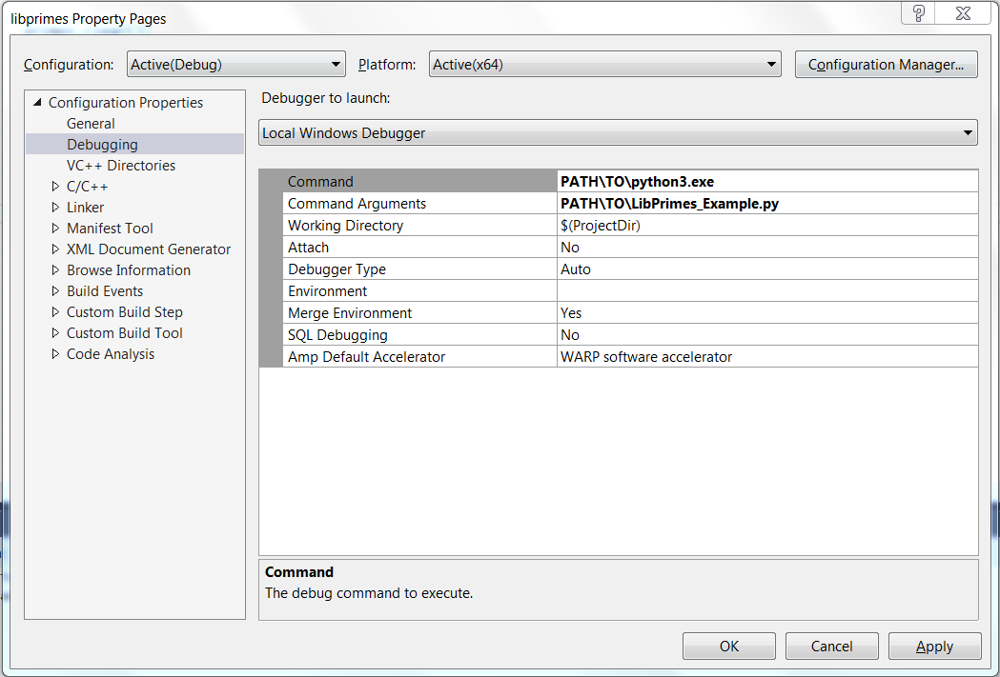

#  Automatic Component Toolkit

## Tutorial: Generating a C++ shared library and bindings for different languages


## Table of Contents

- [1. Introduction](#1-introduction)
- [2. Requirements](#2-requirements)
- [3. The Library's Implementation](#3-the-librarys-implementation)
- [4. The Consumers](#4-the-consumers)
- [5. Extending the Library with a Callback](#5-extending-the-library-with-a-callback)
- [6. Enable journaling](#6-enable-journaling)
- [7. Conclusion](#7-conclusion)

# 1. Introduction
This tutorial demonstrates how to set up and develop a shared library using ACT, and it can be followed step by step.
The focus is not on specific features and details of ACT: its parameters, elements,
options and switches are of the interface definition language are documented in the [Documentation](../../Documentation/IDL.md).
Instead, it lays out a potential workflow around ACT.

If you just want to see a project based no ACT, you can find the final project in the folder [LibPrimes_component](LibPrimes_component).

Consider you want to implement and use a library that provides datatypes and algorithms related to prime numbers. Such a library will be implemented in this tutorial.
In particular, the library will be able to perform the prime-factorization of positive integers and generate prime numbers.

#### Prime factor decomposition
Given a positive integer n, find distinct prime numbers p_1, ..., p_k, and positive integers e_1, ..., e_k
such that
```
n = p_1 ^ e_1 * p_2 ^ e_2 * ... * p_k ^ e_k
```
The values e_j are called multiplicity.

__NOTE__
_There are much more efficient algorithms and more suitable software packages to perform these tasks._

# 2. Requirements
 - CMake
 - A C++ compiler / development environment. This tutorial was tested with Visual Studio 2017, but should also work with `GCC` and `make` or other development tools.
 - ACT: This tutorial is tested to work with release 1.4.0 of ACT. You can get it from [the releases page](https://github.com/Autodesk/AutomaticComponentToolkit/releases).
Decide on a location for your tutorial's component to live in, and download the binary for your platform into this folder. Alternatively, stick it somwhere in your `$PATH`.


# 3. The Library's Implementation
## 3.1. The definition of the component
An ACT component's interface is fully described by its IDL file.
This section sets up an IDL-file for LibPrimes.

First, copy the snippet, a bare-bone IDL-file, and save it into libPrimes.xml in your component's folder.
```xml
<?xml version="1.0" encoding="UTF-8"?>
<component xmlns="http://schemas.autodesk.com/netfabb/automaticcomponenttoolkit/2018" 
	libraryname="Prime numbers Library" namespace="LibPrimes" copyright="PrimeDevelopers" year="2018" basename="libprimes"
	version="1.0.0">
	<license>
		<line value="All rights reserved." />
	</license>
	
	<bindings>
		<binding language="Cpp" indentation="tabs" />
		<binding language="CppDynamic" indentation="tabs" />
		<binding language="Pascal" indentation="4spaces" />
		<binding language="Python" indentation="tabs" />
	</bindings>
	<implementations>
		<implementation language="Cpp" indentation="tabs"/>
		<implementation language="Pascal" indentation="tabs" stubidentifier="impl"/>
	</implementations>
	
	<errors>
		<error name="NOTIMPLEMENTED" code="1" description="functionality not implemented" />
		<error name="INVALIDPARAM" code="2" description="an invalid parameter was passed" />
		<error name="INVALIDCAST" code="3" description="a type cast failed" />
		<error name="BUFFERTOOSMALL" code="4" description="a provided buffer is too small" />
		<error name="GENERICEXCEPTION" code="5" description="a generic exception occurred" />
		<error name="COULDNOTLOADLIBRARY" code="6" description="the library could not be loaded" />
		<error name="COULDNOTFINDLIBRARYEXPORT" code="7" description="a required exported symbol could not be found in the library" />
		<error name="INCOMPATIBLEBINARYVERSION" code="8" description="the version of the binary interface does not match the bindings interface" />
	</errors>
	
	<global releasemethod="ReleaseInstance" versionmethod="GetLibraryVersion">
		<method name="ReleaseInstance" description="Releases the memory of an Instance">
			<param name="Instance" type="handle" class="BaseClass" pass="in" description="Instance Handle" />
		</method>

		<method name="GetLibraryVersion" description = "retrieves the current version of the library.">
			<param name="Major" type="uint32" pass="out" description="returns the major version of the library" />
			<param name="Minor" type="uint32" pass="out" description="returns the minor version of the library" />
			<param name="Micro" type="uint32" pass="out" description="returns the micro version of the library" />
		</method>
	</global>
</component>
```

It's elements define the following:
- The attributes of `\<component>` define essential properties and naming conventions of the component, and contains all other info about the component.
- `\<error>` define the error codes to be used in the library that will be exposed for it's consumers.
The errors listed in this snippet are required.
-`\<global>` defines the global functions that can be used as entry points into the component.
It must contain a `versionmethod` and a `releasemethod` with the signatures in this snippet.
They will be explained in [this section](#331-required-steps-for-every-act-component).
The syntax for methods will be explained when we add new classes and functions to the IDL-file now.


### 3.1.1 A struct for prime factors
In the `\<component>` element, add a struct `PrimeFactor` that encodes a prime number with a multiplicity.
```xml
<struct name="PrimeFactor">
	<member name="Prime" type="uint64" />
	<member name="Multiplicity" type="uint32" />
</struct>
```
### 3.1.1 Calculator
In the `\<component>` element, add a class `Calculator` which implements the base class for
the different calculators we will expose in our API.
```xml
<class name="Calculator">
	<method name="GetValue" description="Returns the current value of this Calculator">
		<param name="Value" type="uint64" pass="return" description="The current value of this Calculator" />
	</method>
	<method name="SetValue" description="Sets the value to be factorized">
		<param name="Value" type="uint64" pass="in" description="The value to be factorized" />
	</method>
	<method name="Calculate" description="Performs the specific calculation of this Calculator">
	</method>
</class>
```
The `GetValue` method returns the current value on which the calculator operates. It has one parameter of type `uint64`, that will be returned.
The `SetValue` method sets the value on which the calculator operates. It has one input parameter of type `uint64`.
The method `Calculate` performs the specific calculation of this calculator.


### 3.1.2 The FactorizationCalculator
Add another class `FactorizationCalculator` as a child class of `Calculator`.
```xml
<class name="FactorizationCalculator" parent="Calculator">
	<method name="GetPrimeFactors" description="Returns the prime factors of this number (without multiplicity)">
		<param name="PrimeFactors" type="structarray" class="PrimeFactor" pass="out" description="The prime factors of this number" />
	</method>
</class>
```
We will implement the actual prime-factor decomposition by overwriting the the `Calculate` method of its parent class.
`FactorizationCalculator` introduces one additional method that outputs an array of structs.

### 3.1.3 The SieveCalculator
Add another class `SieveCalculator` as a child class of `Calculator`.
```xml
<class name="SieveCalculator" parent="Calculator">	
	<method name="GetPrimes" description="Returns all prime numbers lower or equal to the sieve's value">
		<param name="Primes" type="basicarray" class="uint64" pass="out" description="The primes lower or equal to the sieve's value" />
	</method>
</class>
```
Again, we will implement the actual calculation of primes by overwriting the the `Calculate` method of its parent class.
`SieveCalculator` introduces one additional method that will return the array of prime numbers of type `uint64`.

### 3.1.4 Error: no result available
We want to use the error `LIBPRIMES_ERROR_NORESULTAVAILABLE` when a user tries to retrieve
results from a calculator without having performed a calculation before. Thus add a new error
```xml
<error name="NORESULTAVAILABLE" code="9" description="no result is available" />
```


### 3.1.5 Additions to the global section
The global section requires two more methods, that are used as entry points to the component's functionality:
```xml
<method name="CreateFactorizationCalculator" description="Creates a new FactorizationCalculator instance">
	<param name="Instance" type="handle" class="FactorizationCalculator" pass="return" description="New FactorizationCalculator instance" />
</method>
```
`CreateFactorizationCalculator` specifies a global function that will create a new instance of the `FactorizationCalculator`.

```xml
<method name="CreateSieveCalculator" description="Creates a new SieveCalculator instance">
	<param name="Instance" type="handle" class="SieveCalculator" pass="return" description="New SieveCalculator instance" />
</method>
```
`CreateSieveCalculator` specifies a global function that will create a new instance of the `SieveCalculator`.

This concludes the complete specification of LibPrimes's interface.

__NOTE__
_You can download the initial IDL-file for libPrimes [here](ressources/315/libPrimes.xml)._

## 3.2. Automatic Source Code Generation
With the complete interface definition in `libPrimes.xml`, we can now turn on ACT:
```shell
act.exe libPrimes.xml
```
This generates a folder `LibPrimes_component` with two subfolders, `Bindings` and `Implementation`.

Let's focus on `Implementation/CPP` for now, which contains a folder `Interfaces` and `Stubs`

### 3.2.1 Interfaces
Consider all files in the `Interfaces` folder read only for your development.
They will be regenerated/overwritten if you run ACT again, and you should never have to modify them.
Usually, you will not include them in the source code control system of your component.

The `libprimes_interfaces.hpp` file contains all classes from the IDL as pure abstract C++ classes. E.g. have a look at 
the interfaces `ILibPrimesCalculator` and `ILibPrimesFactorizationCalculator`:
```cpp
/*...*/
class ILibPrimesCalculator : public virtual ILibPrimesBaseClass {
public:
	virtual LibPrimes_uint64 long GetValue () = 0;
	virtual void SetValue (const LibPrimes_uint64 nValue) = 0;
	virtual void Calculate () = 0;
};

class ILibPrimesFactorizationCalculator : public virtual ILibPrimesBaseClass, public virtual ILibPrimesCalculator {
public:
	virtual void GetPrimeFactors (LibPrimes_uint64 nPrimeFactorsBufferSize, LibPrimes_uint64 * pPrimeFactorsNeededCount, sLibPrimesPrimeFactor * pPrimeFactorsBuffer) = 0;
};
/*...*/
```

The `libprimes_interfaceexception.hpp` and `libprimes_interfaceexception.cpp` files contain the definition of the component's exception class.

The `libprimes_interfacewrapper.cpp` file implements the forwarding of the C89-interface functions to the classes you will implement.
It also translates all exceptions into error codes.
```cpp
LIBPRIMES_DECLSPEC LibPrimesResult libprimes_calculator_getvalue (LibPrimes_Calculator pCalculator, LibPrimes_uint64 * pValue)
{
	try {
		if (pValue == nullptr)
			throw ELibPrimesInterfaceException (LIBPRIMES_ERROR_INVALIDPARAM);

		ILibPrimesBaseClass* pIBaseClass = (ILibPrimesBaseClass *)pCalculator;
		ILibPrimesCalculator* pICalculator = dynamic_cast<ILibPrimesCalculator*>(pIBaseClass);
		if (!pICalculator)
			throw ELibPrimesInterfaceException(LIBPRIMES_ERROR_INVALIDCAST);

		*pValue = pICalculator->GetValue();

		return LIBPRIMES_SUCCESS;
	}
	catch (ELibPrimesInterfaceException & E) {
		return E.getErrorCode();
	}
	catch (...) {
		return LIBPRIMES_ERROR_GENERICEXCEPTION;
	}
}
```

### 3.2.2 Implementation Stubs
The files in the `Stubs` folder are the "actual" source code, which you will modify. This will contain your domain logic.

For each class in the IDL, a pair of header and source files has been generated.
They contain a concrete class definition derived from the corresponding interface in interfaces.hpp.

```cpp
class CLibPrimesFactorizationCalculator : public virtual ILibPrimesFactorizationCalculator, public virtual CLibPrimesCalculator {
public:
	void Calculate();
	void GetPrimeFactors (LibPrimes_uint64 nPrimeFactorsBufferSize, LibPrimes_uint64 * pPrimeFactorsNeededCount, sLibPrimesPrimeFactor * pPrimeFactorsBuffer);
};
```

The autogenerated implementation of each of a class's methods throws a `NOTIMPLEMENTED` exception:
```cpp
void CLibPrimesFactorizationCalculator::GetPrimeFactors (LibPrimes_uint64 nPrimeFactorsBufferSize,
	LibPrimes_uint64 * pPrimeFactorsNeededCount, sLibPrimesPrimeFactor * pPrimeFactorsBuffer)
{
	throw ELibPrimesInterfaceException(LIBPRIMES_ERROR_NOTIMPLEMENTED);
}
```

## 3.3. Implement and build the library
The `Implementations/CPP` folder already contains a `CMakeLists.txt` that allows you to build the generated sources into a shared library.

The following code snipped sets up a Visual Studio solution:
```bash
cd LibPrimes_component/Implementation/
mkdir _build
cd _build
cmake .. -G "Visual Studio 15 Win64"
cmake --build .
```
Adjust the CMake-Generator for your development environment, if required.

Now we can start actually implementing the library.

### 3.3.1. Required steps for every ACT component
#### GetVersion function
```cpp
void CLibPrimesWrapper::GetLibraryVersion (LibPrimes_uint32 & nMajor, LibPrimes_uint32 & nMinor, LibPrimes_uint32 & nMicro)
{
	nMajor = LIBPRIMES_VERSION_MAJOR;
	nMinor = LIBPRIMES_VERSION_MINOR;
	nMicro = LIBPRIMES_VERSION_MICRO;
}
```

#### CreateFunctions
For all methods in the IDL that are used to return a new instance of a class, code similar to this needs to be implemented.
```cpp
#include "libprimes_factorizationcalculator.hpp"
/*...*/
ILibPrimesFactorizationCalculator * CLibPrimesWrapper::CreateFactorizationCalculator ()
{
	return new CLibPrimesFactorizationCalculator();
}
```

#### Release Function
```cpp
void CLibPrimesWrapper::ReleaseInstance (ILibPrimesBaseClass* pInstance)
{
	delete pInstance;
}
```

__NOTE__:
_Obvioulsy, you can do something more clever/robust, than simply handing out "new"-ed chunks of memory at creation
and deleting them if asked for it via `ReleaseInstance`"
(e.g. store them in a set-datastructure, so that you can "free" them if the consumer does not do so).
However, this is solution is fine in the context of ACT, as all automatically generated bindings
(except `C`) handle the lifetime of all generated ILibPrimesBaseClass instances._

### 3.3.2. Domain code implementation: Steps for LibPrimes
#### CreateFunctions
Implement the missing `CreateSieveCalculator`
```cpp
#include "libprimes_sievecalculator.hpp"
/*...*/
ILibPrimesSieveCalculator * CLibPrimesWrapper::CreateSieveCalculator ()
{
	return new CLibPrimesSieveCalculator();
}
```

#### Calculator
Add a protected member `m_value` to the `CLibPrimesCalculator`
```cpp
class CLibPrimesCalculator : public virtual ILibPrimesCalculator {
protected:
	LibPrimes_uint64 m_value;
/*...*/
}
```
The `GetValue`/`SetValue` methods of the `Calculator` are straight-forward:
```cpp
LibPrimes_uint64 CLibPrimesCalculator::GetValue()
{
	return m_value;
}

void CLibPrimesCalculator::SetValue(const LibPrimes_uint64 nValue)
{
	m_value = nValue;
}
```

We can safely leave the `Calculate`-method untouched, or alternatively, declare it pure virtual,
and remove its implementation.

#### FactorizationCalculator
Add an array that holds the calculated prime factors as private member in `CLibPrimesFactorizationCalculator`
and a public `Calculate` method:
```cpp
class CLibPrimesFactorizationCalculator : public virtual ILibPrimesFactorizationCalculator, public virtual CLibPrimesCalculator
{
private:
	std::vector<sLibPrimesPrimeFactor> primeFactors;
public:
	void Calculate();
/*...*/
}
```

A valid implementation of `GetPrimes` is the following
```cpp
void CLibPrimesFactorizationCalculator::GetPrimeFactors (LibPrimes_uint64 nPrimeFactorsBufferSize,
	LibPrimes_uint64 * pPrimeFactorsNeededCount, sLibPrimesPrimeFactor * pPrimeFactorsBuffer)
{
	if (primeFactors.size() == 0)
		throw ELibPrimesInterfaceException(LIBPRIMES_ERROR_NORESULTAVAILABLE);

	if (pPrimeFactorsNeededCount)
		*pPrimeFactorsNeededCount = (unsigned int)primeFactors.size();

	if (nPrimeFactorsBufferSize >= primeFactors.size() && pPrimeFactorsBuffer)
	{
		for (int i = 0; i < primeFactors.size(); i++)
		{
			pPrimeFactorsBuffer[i] = primeFactors[i];
		}
	}
}
```

The following snippet calculates the prime factor decomposition of the calculator's member `m_value`.
```cpp
void CLibPrimesFactorizationCalculator::Calculate()
{
	primeFactors.clear();

	LibPrimes_uint64 nValue = m_value;
	for (LibPrimes_uint64 i = 2; i <= nValue; i++) {
		sLibPrimesPrimeFactor primeFactor;
		primeFactor.m_Prime = i;
		primeFactor.m_Multiplicity = 0;
		while (nValue % i == 0) {
			primeFactor.m_Multiplicity++;
			nValue = nValue / i;
		}
		if (primeFactor.m_Multiplicity > 0) {
			primeFactors.push_back(primeFactor);
		}
	}
}
```

#### SieveCalculator
Add an array that holds the calculated prime numbers as private member in `CLibPrimesSieveCalculator`
and a public `Calculate` method:
```cpp
class CLibPrimesSieveCalculator : public virtual ILibPrimesSieveCalculator, public virtual CLibPrimesCalculator {
private:
	std::vector<LibPrimes_uint64> primes;
public:
	void Calculate();
/*...*/
}
```

The `GetPrimes` method is analogous to the above `GetPrimeFactors`
```cpp
void CLibPrimesSieveCalculator::GetPrimes (unsigned int nPrimesBufferSize,
	LibPrimes_uint64 * pPrimesNeededCount, LibPrimes_uint64 * pPrimesBuffer)
{
	if (primes.size() == 0)
		throw ELibPrimesInterfaceException(LIBPRIMES_ERROR_NORESULTAVAILABLE);
	if (pPrimesNeededCount)
		*pPrimesNeededCount = (LibPrimes_uint64)primes.size();
	if (nPrimesBufferSize >= primes.size() && pPrimesBuffer)
	{
		for (int i = 0; i < primes.size(); i++)
		{
			pPrimesBuffer[i] = primes[i];
		}
	}
}
```

Finally, the following calculate method implements the [Sieve of Eratosthenes](https://en.wikipedia.org/wiki/Sieve_of_Eratosthenes)
```cpp
void CLibPrimesSieveCalculator::Calculate()
{
	primes.clear();

	std::vector<bool> strikenOut(m_value + 1);
	for (LibPrimes_uint64 i = 0; i <= m_value; i++) {
		strikenOut[i] = i < 2;
	}
	LibPrimes_uint64 sqrtValue = (LibPrimes_uint64)(sqrt(m_value));
	for (LibPrimes_uint64 i = 2; i <= sqrtValue; i++) {
		if (!strikenOut[i]) {
			primes.push_back(i);
			for (LibPrimes_uint64 j = i * i; j < m_value; j += i) {
				strikenOut[j] = true;
			}
		}
	}
	for (LibPrimes_uint64 i = sqrtValue; i <= m_value; i++) {
		if (!strikenOut[i]) {
			primes.push_back(i);
		}
	}
}
```

This concludes the implementation of the library.

# 4. The Consumers
This section will demonstrate how easy it is to consume "LibPrimes". The autogenerated `Bindings` folder contains multiple language bindings,
i.e. APIs for the component native to different languages.

By default ACT creates source code for example command line applications in all specified export languages.
Each of the autogenerated example applications will load the library, retrieve the binary's version and print it.

# 4.1. Cpp Dynamic
The folder `Examples\CppDynamic` contains a simple CMake project and a `LibPrimes_Example.cpp`
that holds the main function of the command line application.
Generate a solution and build it
```shell
cd LibPrimes_component/Examples/CppDynamic
mkdir _build
cd _build
cmake .. -G "Visual Studio 15 Win64"
```
You will have to modify the path to the binary library file we created in section [3. The Library's Implementation](#3-the-librarys-implementation).
```cpp
#include <iostream>
#include "libprimes_dynamic.hpp"

int main()
{
  try
  {
    std::string libpath = (""); // TODO: put the location of the LibPrimes-library file here.
    auto wrapper = LibPrimes::CLibPrimesWrapper::loadLibrary(libpath + "/libprimes."); // TODO: add correct suffix of the library
    unsigned int nMajor, nMinor, nMicro;
    wrapper->GetLibraryVersion(nMajor, nMinor, nMicro);
    std::cout << "LibPrimes.Version = " << nMajor << "." << nMinor << "." << nMicro << std::endl;
  }
  catch (std::exception &e)
  {
    std::cout << e.what() << std::endl;
    return 1;
  }
  return 0;
}
```
Now build the solution
```shell
cmake --build .
```
and run the command line application. It should print out
```shell
LibPrimes.Version = 1.0.0
```

Using LibPrimes's functionality is simple then, e.g. to calculate the prime factor decomposition of a number, 
add the following at the end of the try block:
```cpp
auto factorization = wrapper->CreateFactorizationCalculator();
factorization->SetValue(735);
factorization->Calculate();
std::vector<sLibPrimesPrimeFactor> primeFactors;
factorization->GetPrimeFactors(primeFactors);

std::cout << factorization->GetValue() << " = ";
for (size_t i = 0; i < primeFactors.size(); i++) {
	auto pF = primeFactors[i];
	std::cout << pF.m_Prime << "^" << pF.m_Multiplicity << ((i < (primeFactors.size() - 1)) ? " * " : "");
}
std::cout << std::endl;
```
Rebuild the solution and run the compiled application. It should print out
```shell
LibPrimes.Version = 1.0.0
735 = 3^1 * 5^1 * 7^2
```

Have a look at the implementation of the dynamic Cpp bindings in the single header file `libprimes_dynamic.hpp`,
e.g. a C++ function call is forwarded to the C-interface as follows
```cpp
void GetPrimeFactors (std::vector<sLibPrimesPrimeFactor> & PrimeFactorsBuffer)
{
	LibPrimes_uint64 elementsNeededPrimeFactors = 0;
	LibPrimes_uint64 elementsWrittenPrimeFactors = 0;
	CheckError ( m_pWrapper->m_WrapperTable.m_FactorizationCalculator_GetPrimeFactors (m_pHandle, 0, &elementsNeededPrimeFactors, nullptr) );
	PrimeFactorsBuffer.resize(elementsNeededPrimeFactors);
	CheckError ( m_pWrapper->m_WrapperTable.m_FactorizationCalculator_GetPrimeFactors (m_pHandle, elementsNeededPrimeFactors, &elementsWrittenPrimeFactors, PrimeFactorsBuffer.data()) );
}
```
__Note__ _For the out-array, `m_FactorizationCalculator_GetPrimeFactors` is called twice.
First, to obtain the size of the array, secondly to actually fill the array with content.
Thus, it would be very inefficient to perform the calculation during the `GetPrimeFactors`-method_

All return values of functions are translated to C++ exceptions via the `CheckError`-method:
```cpp
void CheckError(LibPrimesHandle handle, LibPrimesResult nResult)
{
	if (nResult != 0) 
		throw ELibPrimesException (nResult);
}
```

# 4.2. Python
The folder `Examples\Python` contains a python script `LibPrimes_Example.py` that makes
use of the Python bindings `LibPrimes.py`.

In the autogenerated main function set the correct path to the library's binary:
```python
import os
import sys
sys.path.append("../../Bindings/Python")
import LibPrimes

def main():
	libpath = '' # TODO add the location of the shared library binary here
	wrapper = LibPrimes.LibPrimesWrapper(os.path.join(libpath, "LibPrimes"))
	
	major, minor, micro = wrapper.GetLibraryVersion()
	print("LibPrimes version: {:d}.{:d}.{:d}".format(major, minor, micro))

if __name__ == "__main__":
	try:
		main()
	except LibPrimes.ELibPrimesException as e:
		print(e)
```

and add the following code at the end of the main function:
```python
factorization = wrapper.CreateFactorizationCalculator()
factorization.SetValue(735)
factorization.Calculate()
primeFactors = factorization.GetPrimeFactors()
productString = "*"
print("{:d} = ".format(factorization.GetValue()), end="")
for i in range(0, len(primeFactors)):
	pF = primeFactors[i]
	if i == len(primeFactors) - 1:
		productString = "\n"
	print(" {:d}^{:d} ".format(pF.Prime, pF.Multiplicity), end=productString)
```

Running this script will, again, print:
```shell
LibPrimes version: 1.0.0
735 =  3^1 * 5^1 * 7^2 
```

# 4.2.1. Debug the C++-DLL from a Python Host Application
This section explains a neat trick to debug a library that is used in a unrelated project,
even in a different, interpreted language:

In our specific setup, open the Visual Studio solution from
[3. The Library's Implementation](#3-the-librarys-implementation),
set LibPrimes as startup project and make sure the `Debug` configuration is activated.

Open the project's properties and select the entry Debug.
Set the `Command` to the path to your python3 executable and the `Command Arguments`
to the location of the `LibPrimes_Example.py`


Set a breakpoint somewhere in your C++-library code
(e.g. in "void CLibPrimesFactorizationCalculator::Calculate()") and start debugging.

# 4.3. Pascal
The folder `Examples\Pascal` contains a project for the Free Pascal IDE [Lazarus](https://www.lazarus-ide.org/).

Open the project `LibPrimes_Example.lpi` in the IDE, adjust the library path in the `TestLibPrimes` procedure 
and build the application.
```pascal
procedure TLibPrimes_Example.TestLibPrimes ();
var
    ALibPrimesWrapper: TLibPrimesWrapper;
    AMajor, AMinor, AMicro: Cardinal;
    ALibPath: string;
begin
    writeln ('loading DLL');
    ALibPath := ''; // TODO add the location of the shared library binary here
    ALibPrimesWrapper := TLibPrimesWrapper.Create (ALibPath + '/' + 'libprimes.dll');
    try
        writeln ('loading DLL Done');
        ALibPrimesWrapper.GetLibraryVersion(AMajor, AMinor, AMicro);
        writeln (Format('LibPrimes.version = %d.%d.%d', [AMajor, AMinor, AMicro]));
    finally
        FreeAndNil(ALibPrimesWrapper);
    end;
end;
```

The compiled command line application `Examples\Pascal\bin\x86_64-win64\Release\LibPrimes_Example.exe` will output
```shell
loading DLL
loading DLL Done
LibPrimes.version = 1.0.0
```

## 4.4 Use of an ACT component in existing code bases
The examples above started of with prepared and autogenerated projects in three different languages.
We found that a simple task using dynamic language bindings.

In reality, it is more important to integrate a components functionality into _existing_,
potentially large and complex code bases.

However, the integration of an ACT component into other code bases is _as simple_ as integrating it into
a new application.
The only requirement is to include the specific language binding file
(`libprimes_dyanmic.hpp`, `LibPrimes.py`,`Unit_LibPrimes.pas`) into a project
and specifying the location of the components binary.

This concludes the section on using an ACT component via the autogenerated language bindings.


# 5. Extending the Library with a Callback
This section goes through the process of adding new functionality to an ACT component.
We will first modify the IDL-file, secondly regenerate the interfaces and language bindings
and finally adapt one of the example applications use the new feature of the library.

The new functionality will be a callback that reports the progress during the (potentially)
time consuming calculation method of the calculators.

# 5.1 IDL
Open the IDL-file `libPrimes.xml` and add a new `functiontype` element within the `\<component>`-element.
```xml
<functiontype name="ProgressCallback" description="Callback to report calculation progress and query whether it should be aborted">
	<param name="ProgressPercentage" type="single" pass="in" description="How far has the calculation progressed?"/>
	<param name="ShouldAbort" type="bool" pass="out" description="Should the calculation be aborted?"/>
</functiontype>
```
Instances of this functiontype will require a `single` parameter as input to report
the relative progress of the calculation back to the client, 
and have a `bool`ean output value to read back from a client, whether `LibPrimes`
should abort the calculation.

Then add a method to the `Calculator` class that sets the progress callback:
```xml
<method name="SetProgressCallback" description="Sets the progress callback function">
	<param name="ProgressCallback" type="functiontype" class="ProgressCallback" pass="in" description="The progress callback" />
</method>
```

We will handle aborted calculations via a new exceptions, which a client can handle.
Thus, add a new `\<error>`:
```xml
<error name="CALCULATIONABORTED" code="10" description="a calculation has been aborted" />
```

In the [semantic versioning scheme](https://semver.org/), which is advocated by ACT, adding a new function to a components class
requires a minor version update. Thus update the version in the IDL, too:
```xml
<component xmlns="http://schemas.autodesk.com/netfabb/automaticcomponenttoolkit/2018" 
	libraryname="Prime Numbers Interface" namespace="LibPrimes" copyright="Automatic Component Toolkit Developers" year="2018" basename="libprimes"
	version="1.1.0">
```

__NOTE__
_You can download the modified IDL-file for libPrimes [here](ressources/510/libPrimes.xml)._

Finally, recrate interfaces, wrapper and bindings code:
```shell
act.exe libPrimes.xml
```

A quick look at the `libprimes_types.h` and `libprimes_interfaces.hpp` reveals how the `ProgressCallback`
function type and their usage is declared:
```cpp
/*************************************************************************************************************************
 Declaration of function pointers 
**************************************************************************************************************************/
typedef void(*LibPrimesProgressCallback)(LibPrimes_single, bool*);
```
```cpp
class ILibPrimesCalculator : public virtual ILibPrimesBaseClass {
public:
/*...*/
/**
* ICalculator::SetProgressCallback - Sets the progress callback function
* @param[in] pProgressCallback - callback function
*/
virtual void SetProgressCallback (const LibPrimesProgressCallback pProgressCallback) = 0;
/*...*/
}
```

# 5.2 Library
Reopen the  Visual Studio solution from [3. The Library's Implementation](#3-the-librarys-implementation).
You will not be able to successfully rebuild the solution,
since `CLibPrimesCalculator` does not define the `SetProgressCallback`-function.
To resolve this, add a protected member to `CLibPrimesCalculator` and define the public
`SetProgressCallbackFunction`
#### libprimes_calculator.hpp
```cpp
class CLibPrimesCalculator : public virtual ILibPrimesCalculator {
protected:
/*...*/
	LibPrimesProgressCallback m_Callback;
/*...*/
public:
/*...*/
	void SetProgressCallback (const LibPrimesProgressCallback pProgressCallback);
/*...*/
}
```
#### libprimes_calculator.cpp
```cpp
void CLibPrimesCalculator::SetProgressCallback (const LibPrimesProgressCallback pProgressCallback)
{
	m_Callback = pProgressCallback;
}
```

We can use the callback in the calculation function for example like this:
```cpp
void CLibPrimesFactorizationCalculator::Calculate()
{
	primeFactors.clear();

	LibPrimes_uint64 nValue = m_value;
	for (LibPrimes_uint64 i = 2; i <= nValue; i++) {

		if (m_Callback) {
			bool shouldAbort = false;
			(*m_Callback)(1 - float(nValue) / m_value, &shouldAbort);
			if (shouldAbort) {
				throw ELibPrimesInterfaceException(LIBPRIMES_ERROR_CALCULATIONABORTED);
			}
		}

		sLibPrimesPrimeFactor primeFactor;
		primeFactor.m_Prime = i;
		primeFactor.m_Multiplicity = 0;
		while (nValue % i == 0) {
			primeFactor.m_Multiplicity++;
			nValue = nValue / i;
		}
		if (primeFactor.m_Multiplicity > 0) {
			primeFactors.push_back(primeFactor);
		}
	}
}
```
__Note__
_C function pointers have to be handled carefully.
It's good practice to wrap them in more convenient function objects that make their usage safe
(i.e. check that the function pointer itself as well as their out-parameters are assigned).
Later versions of ACT might do that._

Now, recompile the solution.

# 5.3 Consumer
The usage of the callback functionality from the client applications is straightforward,
as their respective language bindings have already been updated at the end of step.

## 5.3.1 Cpp Dynamic Application with Callback
Open the solution from [Section 4.1](#41-cpp-dynamic), and add a concrete implementation of the
"LibPrimesProgressCallback" function-type:
```cpp
void progressCallback(LibPrimes_single progress, bool* shouldAbort)
{
	std::cout << "Progress = " << round(progress * 100) << "%" << std::endl;
	if (shouldAbort) {
		*shouldAbort = progress > 0.5;
	}
}
```

Using it in `main` is straightforward:
```cpp
int main()
{
	/*...*/
	factorization->SetValue(735);
	factorization->SetProgressCallback(progressCallback);
	factorization->Calculate();
	/*...*/
}
```

Running the compiled command line application will output:
```shell
LibPrimes.Version = 1.1.0
Progress = 0%
Progress = 0%
Progress = 67%
LibPrimes Error 10
```
Error 10 (`CALCULATIONABORTED`) notifies us that a calculation has been aborted, as we expected.

## 5.3.2 Python Application with a callback
Open the Python example from [Section 4.2](42-python), and add an implementation of the
a Python function:
```python
def progressCallback(progress, shouldAbort):
	print("Progress = {:d}%".format(round(progress*100)))
	if (shouldAbort is not None):
		shouldAbort[0] = progress > 0.5
```

Using it in `main` requires one to first create a CTypes function pointer `cTypesCallback` to the Python function.
You need to make sure that these CTypes function pointer still exist in the python host application,
when it will called by the library, e.g. like this:
```python
# ...
factorization.SetValue(735)
cTypesCallback = LibPrimes.LibPrimesProgressCallback(progressCallback)
factorization.SetProgressCallback(cTypesCallback)
factorization.Calculate()
# ...
```

Running the python script will output:
```shell
LibPrimes version: 1.1.0
Progress = 0%
Progress = 0%
Progress = 67%
LibPrimesException 10
```

# 6. Enable journaling
ACT provides automatic journaling, that can be compiled into the software component
and enabled/disabled dynamically during the usage of the component.


## 6.1 Update the IDL file
To add the journaling, simply add a `journalmethod` to the IDL file `libPrimes.xml`:
```xml
<global releasemethod="ReleaseInstance" journalmethod="SetJournal" versionmethod="GetLibraryVersion">
<!--...-->
	<method name="SetJournal" description="Handles Library Journaling">
		<param name="FileName" type="string" pass="in" description="Journal FileName" />
	</method>
</global>
```
Since a new function has been added, another minor version update is required.
```xml
<component xmlns="http://schemas.autodesk.com/netfabb/automaticcomponenttoolkit/2018" 
	libraryname="Prime Numbers Interface" namespace="LibPrimes" copyright="Automatic Component Toolkit Developers" year="2018" basename="libprimes"
	version="1.2.0">
```

__NOTE__
_You can download the modified IDL-file for libPrimes [here](ressources/610/libPrimes.xml)._

Regenerate the implementation and language bindings by running
```shell
act.exe libPrimes.xml
```

Check the updated `libprimes_interfacewrapper.cpp` and its autogenerated
SetJournal method
```cpp
LIBPRIMES_DECLSPEC LibPrimesResult libprimes_setjournal (const char * pFileName)
{
	try {
		if (pFileName == nullptr) 
			throw ELibPrimesInterfaceException (LIBPRIMES_ERROR_INVALIDPARAM);
		std::string sFileName(pFileName);
		m_GlobalJournal = nullptr;
		if (sFileName != "") {
			m_GlobalJournal = std::make_shared<CLibPrimesInterfaceJournal> (sFileName);
		}
		return LIBPRIMES_SUCCESS;
	}
	catch (ELibPrimesInterfaceException & E) {
		return E.getErrorCode();
	}
	catch (...) {
		return LIBPRIMES_ERROR_GENERICEXCEPTION;
	}
}
```
__Note__ _The journalmethod is not forwarded to a C++ class but completely handled
in the wrapper itself._

This is how the journal is filled by other methods:
```cpp
LIBPRIMES_DECLSPEC LibPrimesResult libprimes_calculator_getvalue (LibPrimes_Calculator pCalculator, LibPrimes_uint64 * pValue)
{
	PLibPrimesInterfaceJournalEntry pJournalEntry;
	try {
		if (m_GlobalJournal.get() != nullptr)  {
			pJournalEntry = m_GlobalJournal->beginClassMethod(pCalculator, "Calculator", "GetValue");
		}

		if (pValue == nullptr)
			throw ELibPrimesInterfaceException (LIBPRIMES_ERROR_INVALIDPARAM);
		ILibPrimesBaseClass* pIBaseClass = (ILibPrimesBaseClass *)pCalculator;
		ILibPrimesCalculator* pICalculator = dynamic_cast<ILibPrimesCalculator*>(pIBaseClass);
		if (!pICalculator)
			throw ELibPrimesInterfaceException(LIBPRIMES_ERROR_INVALIDCAST);

		*pValue = pICalculator->GetValue();

		if (pJournalEntry.get() != nullptr) {
			pJournalEntry->addUInt64Result ("Value", *pValue);
			pJournalEntry->writeSuccess();
		}
		return LIBPRIMES_SUCCESS;
	}
	catch (ELibPrimesInterfaceException & E) {
		if (pJournalEntry.get() != nullptr)
			pJournalEntry->writeError(E.getErrorCode());
		return E.getErrorCode();
	}
	catch (...) {
		if (pJournalEntry.get() != nullptr)
			pJournalEntry->writeError(LIBPRIMES_ERROR_GENERICEXCEPTION);
		return LIBPRIMES_ERROR_GENERICEXCEPTION;
	}
}
```

Before you can rebuild the LibPrimes shared library, add the journals implementation-file
to the `${LIBPRIMES_SRC}` in the `CMakeLists.txt`-file:
```shell
set(LIBPRIMES_SRC ${LIBPRIMES_SRC}
	${CMAKE_CURRENT_AUTOGENERATED_DIR}/libprimes_interfaceexception.cpp
	${CMAKE_CURRENT_AUTOGENERATED_DIR}/libprimes_interfacewrapper.cpp
	${CMAKE_CURRENT_AUTOGENERATED_DIR}/libprimes_interfacejournal.cpp
)
```

Journaling can be a great way to help resolving bugs in software components
once they are used by a other people.

## 6.3 Use journaling in a client
Simply add a call of the `SetJournal`-method in the clients' code:

### 6.3.1 CppDynamic Test application
```cpp
int main()
{
	try
	{
		std::string libpath = ""; // TODO: put the location of the LibPrimes-library file here.
		auto wrapper = LibPrimes::CLibPrimesWrapper::loadLibrary(libpath + "/libprimes");
		wrapper->SetJournal("journal_cppdynamic.xml");

		unsigned int nMajor, nMinor, nMicro;
		wrapper->GetLibraryVersion(nMajor, nMinor, nMicro);
		/*..*/
	}
	/*..*/
}
```

The generated xml-file is a detailed journal of all calls, parameters, return values and exceptions
that go through the interface:
```xml
<?xml version="1.0" encoding="UTF-8" ?>
<journal library="LibPrimes" version="1.2.0" xmlns="http://schemas.autodesk.com/components/LibPrimes/1.2.0">
	<entry method="GetLibraryVersion" timestamp="1" duration="0">
		<result name="Major" type="uint32" value="1" />
		<result name="Minor" type="uint32" value="2" />
		<result name="Micro" type="uint32" value="0" />
	</entry>

	<entry method="CreateFactorizationCalculator" timestamp="1" duration="0">
		<result name="Instance" type="handle" value="0000000003d821b8" />
	</entry>

	<entry class="Calculator" method="SetValue" timestamp="1" duration="0">
		<instance handle="0000000003d821b8" />
		<parameter name="Value" type="uint64" value="735" />
	</entry>

	<entry class="Calculator" method="SetProgressCallback" timestamp="1" duration="0">
		<instance handle="0000000003d821b8" />
	</entry>

	<entry class="Calculator" method="Calculate" errorcode="9" timestamp="1" duration="0">
		<instance handle="0000000003d821b8" />
	</entry>

	<entry method="ReleaseInstance" timestamp="2" duration="0">
		<parameter name="Instance" type="handle" value="0000000003d821b8" />
	</entry>
</journal>
```

### 6.3.2 Python Test application
Again, simply call the `SetJournal`-method and run the script:
```python
def main():
	libpath = '' # TODO add the location of the shared library binary here
	wrapper = LibPrimes.LibPrimesWrapper(os.path.join(libpath, "libprimes"))
	wrapper.SetJournal('journal_python.xml')
	
	major, minor, micro = wrapper.GetLibraryVersion()
	print("LibPrimes version: {:d}.{:d}.{:d}".format(major, minor, micro))
	# ...
```
The generated xml-journal is similar to the one shown above.

# 7. Conclusion
This tutorial has walked through a basic development cycle using ACT
and conveyed the power of ACT to simplify and automate the development of components.
Moreover, it has shown how easy ACT components can be integrated in standalone or existing
code bases with ease.

Other important aspects of software componentization, like packaging and distribution,
source code control, stable interfaces, versioning, releases, ...
can also be supported and simplified by ACT.

Tutorials or articles about these topics will follow.